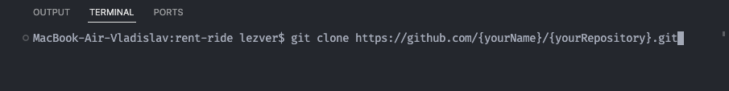
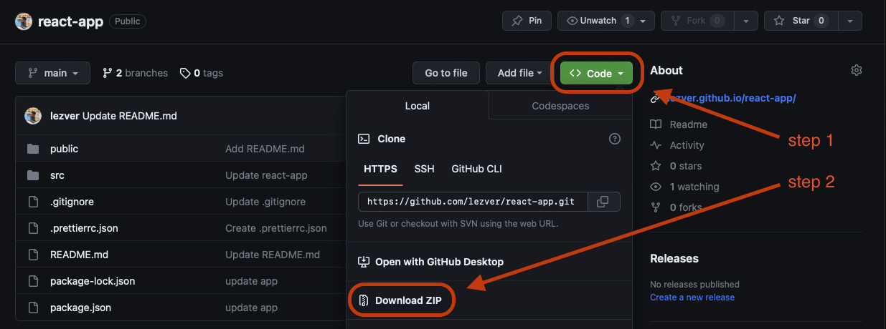
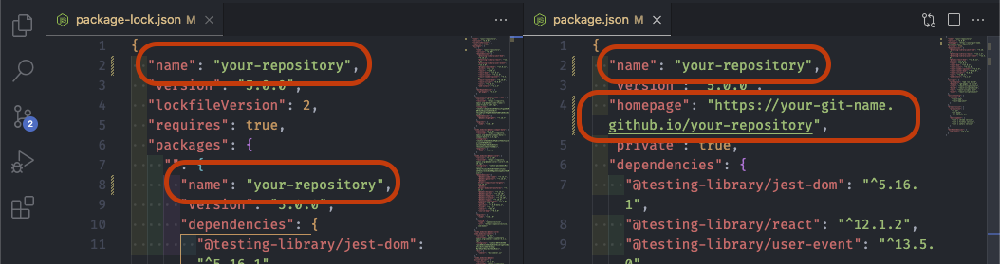

This collection is ready to be deployed on GitHub Pages. To use:

1. Create a new repository on GitHub Pages and localize this command in the
   terminal:

   

2. Download the zip archive.

   

3. Copy everything from the archive to your local folder (your new
   project/repository) and change the package.json ("name": "yourRepository" and
   "homepage": "https://{yourName}.github.io/{yourRepository}") and
   package-lock.json (both "name": "yourRepository")

   local repository mast be empty!!!

   

4. If you want to push your repository, you can use this command in the terminal
   :

   git add .

   git commit -m " "

   git push

   npm run build

   npm run deploy

5. That's it, enjoy 😅
